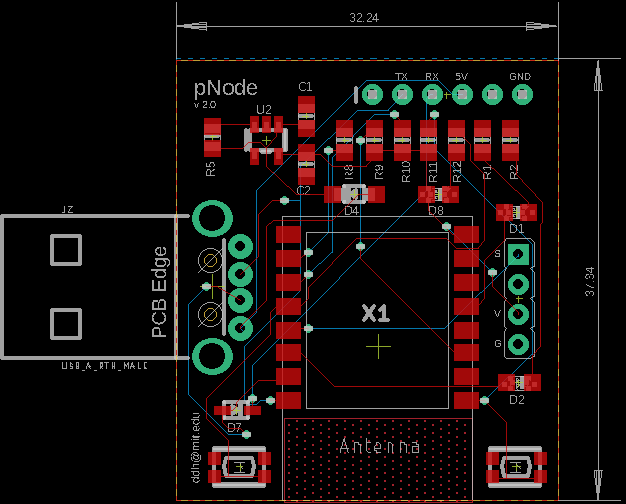
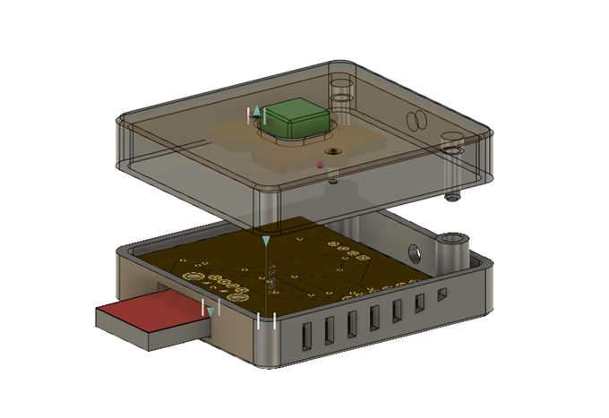

# pNode v2.0
## Installing Firmware
Make sure you have ```python``` and ```pip``` installed so that you can download and install ```esptool```
```
pip install esptool
```
Connect pNode to an FTDI chip via its USB port. The one we're using could be pruchased form sparkfun: https://www.sparkfun.com/products/9716

Restart pNode while pressing reset and the boot button on the back of the PCB until indicated by red LED. Once on, the pNode is in boot-loading mode, and it's ready for a new firmware update.

First, completely erase flash memory:
```
esptool.py --port /dev/cu.usbserial-A50285BI --baud 115200 erase_flash
```

Then, write firmware:

```
esptool.py --port /dev/cu.usbserial-A50285BI --baud 115200 write_flash -fm dio 0x00000 nodemcu-firmware-float.bin
```

Note: In case firmware image was lost, use the following custom builds generator here: https://nodemcu-build.com/ with the following options: **file, gpio, http, node, sjson, tmr, uart, wifi**
then flash the float binary to the nodemcu using the esptool command.

Next make sure you have ```node``` and ```npm``` installed on your system to be able to install ```nodemcu-tool```

```
sudo npm install nodemcu-tool -g
```

for more information on ```nodemcu-tool``` please check further documentation here: https://www.npmjs.com/package/nodemcu-tool

Reboot pNode and wait until system memory is cleared. You can monitor this process using ```nodemcu-tool``` terminal interface

```
nodemcu-tool terminal
```

Note that this repo's directory contains a .nodemcutool configuration file with the following settings:

```
{
    "baudrate": "115200",
    "port": "/dev/cu.usbserial-A50285BI",
    "optimize": true,
    "compile": false,
    "keeppath": false
}
```

Having this configuration file prevents the need of having ```port``` and ```baudrate``` added to every single ```nodemcu-tool``` command. Change the serial port settings based on your system's environment.

Tip: one quick way to figure out the serial port is by looking at the /dev directory on UNIX based systems while re-plugging the FTDI.

```
cd /dev
ls -all
```

## Configuration

The application architecure running on the pNode follows the nodemcu paradigm, it's been programmed using the lua scripting language. For more information about nodemcu and lua please check the following link: https://nodemcu.readthedocs.io/en/master/

Use the ```nodemcu-tool``` command to upload, download, and run ```.lua``` scripts on the pNode. First edit the config.lua script with the editor of your choice with your WiFi ssid and password. Next, make sure to give your device a name, and a key. Also make sure that the token field is empty.

Note: if you're registering a new device, make sure that the token field is empty, this is the only way a pNode can be registered to the database. After a device is added to the database, copy it's token and paste it back into the configuration file, then re-upload the configuration file, and you're all set.

For more information on the security mechanisms used to protect HTTP requests, please check the server's repo here: https://github.com/XDXDXDXDXDXD/pNode-Server

The following commands is used to upload ```.lua``` scripts onto your new device.

```
nodemcu-tool upload config.lua
```

To upload the rest of the files you can use the following script called ```./upload.sh```

make sure it's executable first, before running it.
```
sudo chmod +x upload.sh
```
If at any time you needed to download or remove a file from the pNode use the following

```
nodemcu-tool download config.lua
nodemcu-tool remove config.lua
```

Reboot node, and monitor it's activity using the ```nodemcu-tool``` terminal interface.

## Hardware

### PCB

<p align="center">
  
</p>

the pNode is a custom fork of the Adafruit's open source HUZZAH ESP8266 Breakout based on the ESP-12 SMD version of the ESP8266. More resources to be found here: https://learn.adafruit.com/adafruit-huzzah-esp8266-breakout/overview

The PCB folder contains the schematics and pcb-layout done with eagle 8.1 as well as the build of material (BOM) and gerber files.

### Enclosure

<p align="center">
  
</p>

The enclosure was designed using Fusion 360, then 3D printed with an original Prusa I3
MK3S 3D printer with  Galaxy Silver PLA under default settings. STL files included in Enclosure folder.

Fusion 360 Link here: https://a360.co/2N8dewv

## License

The MIT License (MIT)

Permission is hereby granted, free of charge, to any person obtaining a copy of this software and associated documentation files (the "Software"), to deal in the Software without restriction, including without limitation the rights to use, copy, modify, merge, publish, distribute, sublicense, and/or sell copies of the Software, and to permit persons to whom the Software is furnished to do so, subject to the following conditions:

The above copyright notice and this permission notice shall be included in all copies or substantial portions of the Software.

THE SOFTWARE IS PROVIDED "AS IS", WITHOUT WARRANTY OF ANY KIND, EXPRESS OR IMPLIED, INCLUDING BUT NOT LIMITED TO THE WARRANTIES OF MERCHANTABILITY, FITNESS FOR A PARTICULAR PURPOSE AND NONINFRINGEMENT. IN NO EVENT SHALL THE AUTHORS OR COPYRIGHT HOLDERS BE LIABLE FOR ANY CLAIM, DAMAGES OR OTHER LIABILITY, WHETHER IN AN ACTION OF CONTRACT, TORT OR OTHERWISE, ARISING FROM, OUT OF OR IN CONNECTION WITH THE SOFTWARE OR THE USE OR OTHER DEALINGS IN THE SOFTWARE.
